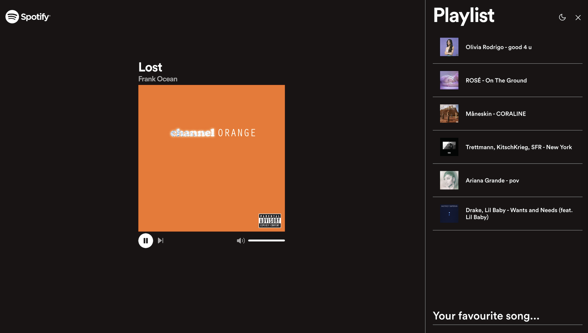

"Live Music for Spotify" is a full stack fun project (originally to play with Golang for the first time) about an in rooms organized application for strangers or friends to meet and listen to music, using **Next.js**, **Golang**, a **Redis** in-memory database connected via **WebSocket** to "broadcast" music to active rooms. 

## Frontend
- Typescript
- React.js
- Next.js
- Styled Components
- Spotify Web Api
- Spotify Wep Playback SDK

## Backend
- Golang
- Websocket
- Redis in-memory database

## Getting Started with Docker
To run the application locally you can either follow the instructions within the respective directories or use docker compose to initialize backend, frontend and redis at once:

1. Within each directory, copy `.env.public` to `.env` and fill in the missing details (Spotify Web API keys)
2. Within the root directory run `docker compose up`
3. Go to http://localhost:3000/
4. Done!
